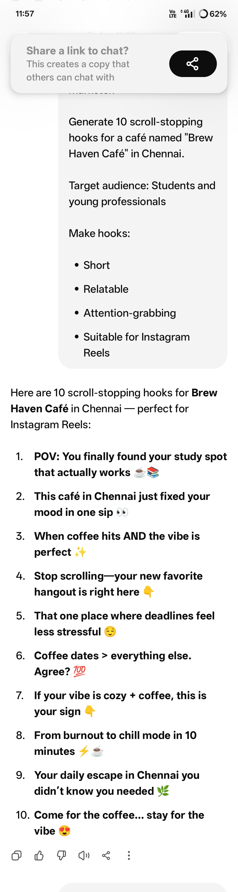
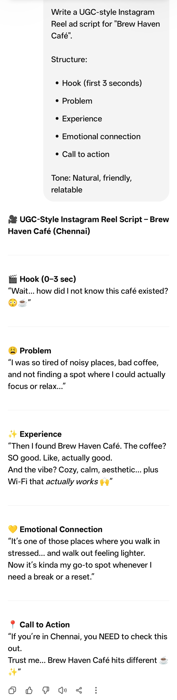
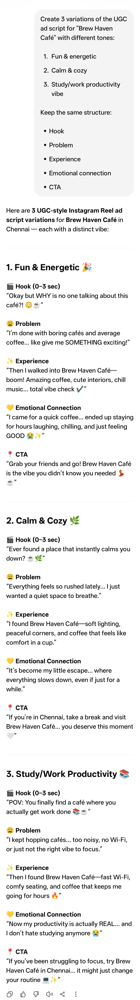
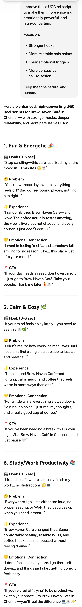
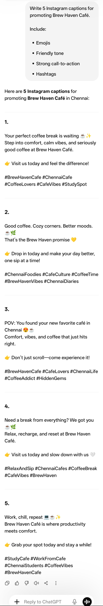

# 🚀 FUTURE_PE_02

---

## 📌 Project Title
**AI Content Marketing using UGC Ads**

---

## 🎯 Objective
To create high-converting social media advertisement content using **prompt engineering techniques**, focusing on UGC-style storytelling for better engagement and conversions.

---

## 🧠 Project Overview
This project demonstrates how AI can be used to generate **marketing-ready UGC (User Generated Content) ads** for Brew Haven Café. It includes structured prompts to create:

- Scroll-stopping hooks  
- Emotional storytelling ad scripts  
- Multiple creative variations  
- Instagram captions with CTA  
- Improved high-conversion ad versions  

The goal is to simulate real-world digital marketing content creation using AI tools.

---

## 🛠️ Tools Used
- ChatGPT (Prompt Engineering & Content Generation)
- GitHub (Version Control & Documentation)

---

## ✨ Key Features
- 🔥 Scroll-stopping hooks designed for social media attention
- 🎬 UGC-style ad scripts (Reels/Instagram Ads)
- 💡 Multiple emotional tone variations (fun, aesthetic, relatable)
- 📢 High-conversion captions with CTA
- 🚀 Iteratively improved ad versions
- 📱 Social media marketing-focused content structure

---

## ⚙️ Workflow
1. Designed structured prompts for UGC ad generation  
2. Created engaging hooks for attention capture  
3. Generated multiple ad script variations  
4. Improved scripts using iterative prompt refinement  
5. Created Instagram captions with emotional CTA  
6. Documented outputs in GitHub repository  

---

## 📊 Results / Impact
- Improved understanding of AI-driven content marketing  
- Learned how to create high-conversion UGC ad structures  
- Developed prompt engineering skills for marketing use cases  
- Built real-world social media ad campaign simulation  

---

## 📚 What I Learned
- How UGC ads influence consumer attention  
- Importance of emotional hooks in marketing  
- Iterative prompt optimization techniques  
- AI-assisted content creation for social media  

---

## 📸 Screenshots

### Hooks

### UGC Script

### Variations

### Improved Ads

### Instagram Captions

---

## 👩‍💻 Author
**Swathi K**

---

## 🚧 Status
✔ Completed (Portfolio Ready Version)
